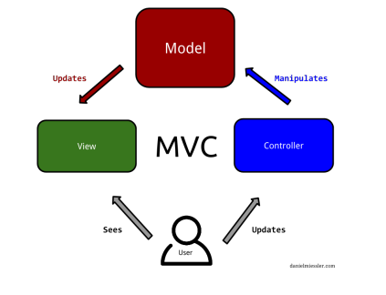
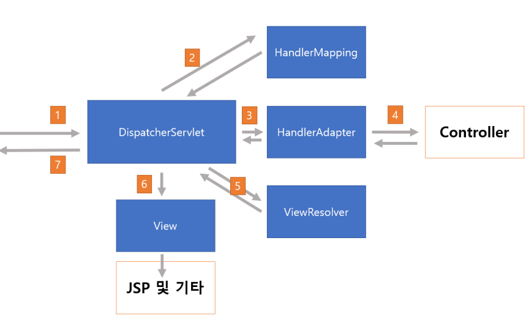
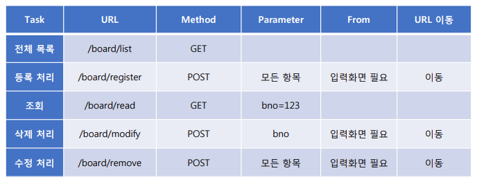

# Spring MVC를 이용한 게시판 구현

## 01. Spring Framework 개발환경 요소
- JDK
- Oracle
- Spring
- Mybatis
- Maven
- Apache Server(Tomcat)
  

## 02. MVC(Model-View-Controller)
- 대부분의 서블릿 기반 프레임워크들이 사용하는 방식
- 데이터와 처리, 화면을 분리하는 방식 
  

## 03. 스프링 MVC의 기본 흐름
   

## 04. 웹 계층의 구현
   

## 05. 기능
- 게시글 목록 조회
- 게시글 목록 페이징
- 게시글 업데이트
- 게시글 삭제
- 게시글 검색
- 게시글 조회수 증가

  
